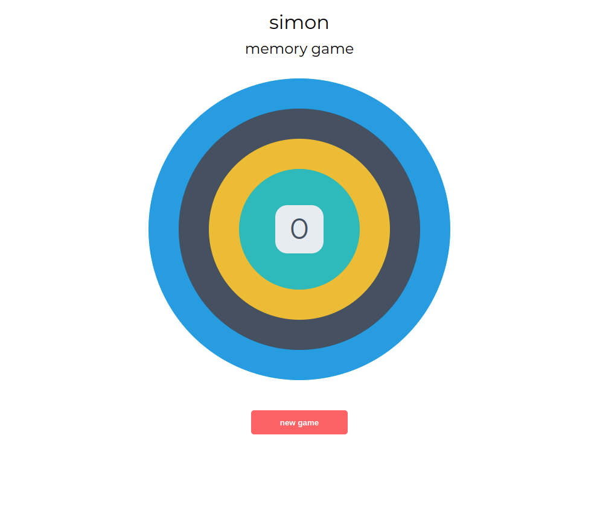

# Simon Game

Welcome to the Simon Game, a classic memory game where you test your memory skills by repeating increasingly longer sequences of lights and sounds.

## About

The Simon Game project is a web-based implementation of the classic Simon game. It's built using HTML, CSS, and JavaScript and follows the traditional rules of the Simon game:

- The game starts with a sequence of colors that the player must remember.
- The player then repeats the sequence by clicking on the colored buttons in the correct order.
- If the player succeeds, the game adds another color to the sequence, making it longer and more challenging.
- If the player makes a mistake, the game ends.

## Features

- **Test-Driven Development (TDD)**: The game logic was developed using a Test-Driven Development approach, ensuring robustness and reliability. All code changes were driven by tests, guaranteeing that each feature behaves as expected.
- **Jest Testing**: The project uses Jest, a JavaScript testing framework, for unit and integration testing the game logic. Jest ensures that each component and function of the game operates correctly and reliably.
- **Responsive Design**: The game is designed to be responsive, providing an optimal experience across various devices and screen sizes.
- **Responsive Design**: The game is designed to be responsive, providing an optimal experience across various devices and screen sizes.
- **Scoring System**: The game keeps track of the player's score, rewarding successful sequences and challenging them to achieve higher scores.
- **New Game Button**: Players can start a new game at any time by clicking the "New Game" button.

## Usage

To play the Simon Game:
1. Clone this repository to your local machine.
2. Open the `index.html` file in your web browser.
3. Click the "New Game" button to start a new game.
4. Watch and listen to the sequence of colors played by the game.
5. Repeat the sequence by clicking on the colored buttons in the correct order.
6. Continue playing and try to beat your high score!

## Contributions

Contributions to the Simon Game project are welcome! If you have any suggestions, bug fixes, or new features to propose, feel free to submit a pull request.

## Credits

This project is based on the Simon Game walk-through project provided by [Code Institute](https://codeinstitute.net/). I learned and implemented the game logic following their tutorials and instructions.
